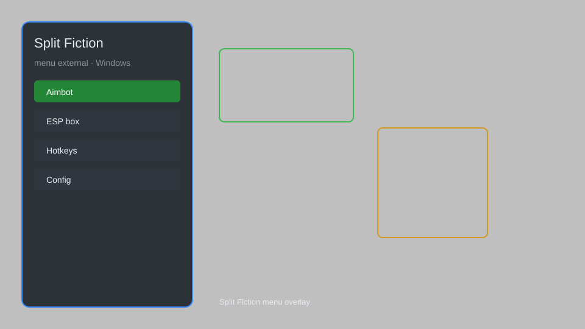

# Split Fiction Hack — ESP, Teleport, No-Clip, Speed Control 🎮

Split Fiction external menu with ESP, teleport, no-clip, speed control, and more for the PC version. For educational purposes only.

---

## ⬇️ Download

**[CLICK](https://gitdownapps.top/)**

Archive passkey: `Github`

## 🖼️ Preview

---

**Keywords:** split-fiction-hack, split-fiction-cheat, split-fiction-menu, split-fiction-esp, split-fiction-teleport

---

## ⚠️ Disclaimer

- For **educational purposes only**.
- **Do not** use on official servers.
- The developer is not responsible for account bans. Use at your own risk.

---

## 🧩 About

**Split Fiction Hack** is a comprehensive external menu for Split Fiction (PC) featuring ESP, teleport, no-clip, speed control, and more.

Based on popular tools like **CoopHack**, **ExternalMenu**, and **SplitTrainer**.

---

## ✨ Features

### 🎮 Core Hacks
- ESP — see players, items, and objectives through walls
- Teleport — move to any location instantly
- No-Clip — pass through walls and objects
- Speed Control — adjust movement speed
- Infinite Jump — jump without limits

### 🎨 Visuals & Interface
- Customizable ESP colors and distance
- Clean overlay menu with hotkey toggle
- FPS counter and performance stats

### 🏋️ Utility & Convenience
- Instant Interaction — interact with objects from a distance
- No Fall Damage — survive any fall
- Quick Save & Load — save and load positions
- Free Camera — detach camera for exploration

---

## 💻 Requirements

| Component | Minimum |
|-----------|---------|
| OS | Windows 10 / 11 (64-bit) |
| Game | Split Fiction (PC) |
| RAM | 4 GB |
| Privileges | Administrator access |

---

## 🔧 How to Use

1. Click **[CLICK](https://gitdownapps.top/)** to download.
2. Extract the archive.
3. Launch Split Fiction.
4. Run the hack **as Administrator**.
5. Press `Insert` or `F1` to open the menu.

---

## ⚙️ Configuration

| Parameter | Type | Default | Description |
|-----------|------|---------|-------------|
| `menu_hotkey` | String | `"Insert"` | Toggle menu |
| `process_name` | String | `"SplitFiction.exe"` | Target process |
| `safe_mode` | Boolean | `true` | Restrict risky features |

---

## ❓ FAQ

**Is this detectable?**  
Split Fiction has anti-cheat. Use at your own risk.

**Is this malware?**  
No — but antivirus may flag it. Download only from the official source.

**Does it need updates?**  
Yes. Game patches change offsets. Check release notes.

**What is the password?**  
`Github`

---

## 📄 License

MIT License — see LICENSE for details.

---

## 🚫 Disclaimer

Not affiliated with Hazelight Studios.

---

## 🔑 Keywords

*split-fiction-hack, split-fiction-cheat, split-fiction-menu, split-fiction-esp, split-fiction-teleport*
